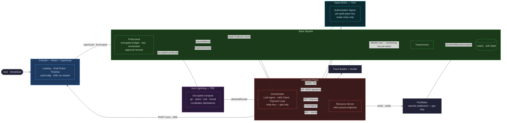

<p align="center">
  This repository contains the submission for the <strong>NTU InnovateX Hackathon 2026</strong>
  — Track 2, co-organised by NTU CCTF &amp; SNZ — from
  <strong>Adarsh Kumar</strong> (IIT Patna) and <strong>Krishan Pratap Sharma</strong> (IIT Bombay).
</p>

<p align="center">
  
</p>

<p align="center">
  <a href="https://youtu.be/jCm6Ps4TSdg"></a>
  <a href="https://github.com/adarshkr7/LedgerLighthouse/actions/workflows/ci.yml"></a>
  <a href="https://github.com/adarshkr7/LedgerLighthouse/actions/workflows/ci.yml"></a>
  <a href="https://sepolia.basescan.org/address/0x0C759D06a1c14F43852D7b078Db2f8C342F15921"></a>
  
  
  
</p>

# LedgerLighthouse

**Confidential spending-policy infrastructure for autonomous AI agents, built on Inco Lightning.**

**[Watch the demo →](https://youtu.be/jCm6Ps4TSdg)**

LedgerLighthouse is a full-stack agentic payment system that lets an LLM agent buy API resources over
x402 without ever holding spending authority. The protocol evaluates every spend against a budget
that is encrypted on chain, commits the debit before the decision is knowable, verifies the resulting
attestation in the contract, and only then releases an EIP-3009 signature from a key held inside an
attested enclave.

Designed as production-shaped infrastructure with an explicit trust model, a CI-enforced code
boundary, and independently verifiable execution traces.

## Executive Summary

- **Product:** a spending policy an agent cannot read, alter, forge, or talk its way past.
- **Confidentiality:** Inco Lightning holds the budget as ciphertext on Base and returns attested decisions.
- **Key custody:** Oasis ROFL (TDX) derives each per-goal payer key in-enclave; no operator can extract it.
- **Settlement:** x402 v1 `exact` scheme — EIP-3009 USDC transfers on Base Sepolia via a self-hosted facilitator.
- **Verifiability:** hash-chained trace with a Merkle root; the standalone verifier needs only the file and a public RPC.
- **The invariant:** compromise of the AI orchestrator must not confer arbitrary spending authority.

## What Is Built

Running code, not a design document. Every item below is exercised by the test suite or by
`pnpm --filter @ntux402/e2e run demo`.

### Contracts — live on Base Sepolia

- **`PolicyVault`** deployed and verified at [`0x0C759D06a1c14F43852D7b078Db2f8C342F15921`](https://sepolia.basescan.org/address/0x0C759D06a1c14F43852D7b078Db2f8C342F15921) — [`contracts/src/PolicyVault.sol`](contracts/src/PolicyVault.sol)
- **Encrypted budget** held as `euint256`, converted from a client ciphertext bound to `msg.sender`
- **Write-ahead conditional debit** via `e.select` on the operand, committed before the decision is knowable
- **On-chain attestation verification** — `e.verifyDecryption` bound to the handle the vault itself stored
- **Frozen authorization tuple** — `termsHash` plus a deterministic nonce, re-readable so a retry is byte-identical
- **Structural reverts separated from policy decisions**, so an over-budget request lands on chain and bounces visibly
- **Goal lifecycle** — open, allowlist, expiry, sequential `seq`, owner-only closure

### Confidential compute — Inco Lightning 1.0.2

- **Client-side HPKE encryption** in the browser before any transaction is sent
- **Encrypted comparison and debit** — `ge`, `select`, `sub`, with `allowThis` grants on every persisted handle
- **Attested reveal polling** bounded at 180 s, attempts and latency recorded — [`services/orchestrator/src/inco/reveal.ts`](services/orchestrator/src/inco/reveal.ts)
- **Flipped-plaintext rejection** proven under test — a genuine attestation paired with the opposite claim fails on chain
- **`decision-unavailable`** carried as an outcome distinct from `policy-rejected`, because the debit already committed
- **Isolated confidential-path check** via `tee-check` — no USDC moves, no signer starts, no vendor is contacted

### Key custody — Oasis ROFL

- **`RoflKeyStore`** derives per-goal payer keys through `rofl-appd`, covered by 12 dedicated tests — [`services/signer/src/keystore.ts`](services/signer/src/keystore.ts)
- **Local file-store fallback** for laptop runs, with the trust difference documented rather than hidden
- **Container manifest and Dockerfile** committed and buildable — [`services/signer/`](services/signer/)

### Payment path — x402 v1

- **Schema-first 402 parsing** — amount, payee and asset taken from structured fields; vendor prose routed only to the model
- **LLM agent** on Anthropic, with a scripted offline fallback that reproduces injection compliance — [`services/orchestrator/src/agent/`](services/orchestrator/src/agent/)
- **Nine-stage payment loop** in which a rejection is terminal and first-class, never retried — [`services/orchestrator/src/pay/payment-loop.ts`](services/orchestrator/src/pay/payment-loop.ts)
- **Non-discretionary Authorization Signer** accepting `(goalId, seq)` and nothing else, with 8 specified refusal codes
- **Self-hosted x402 facilitator** exposing `/verify`, `/settle`, `/supported` — [`services/facilitator/`](services/facilitator/)
- **Stub settlement mode** that validates payloads, moves no money, and labels every response `simulated`

### Verifiability

- **Hash-chained trace** with a Merkle root over step hashes — [`services/trace/`](services/trace/)
- **Standalone verifier CLI** needing only the trace file and a public RPC
- **Handle-lineage cross-check** — the attested handle must equal the one `PolicyVault` stored
- **Bounced attempts retained** in the chain, so a refusal is auditable rather than absent

### Interface and tooling

- **Web console** — MetaMask goal opening, payer funding, live SSE timeline — [`apps/web/`](apps/web/)
- **Shared demo catalog** imported by vendor, orchestrator and UI, so charged and displayed prices cannot drift
- **CI-enforced import boundary** preventing the orchestrator from reaching the signer — [`scripts/check-boundary.mjs`](scripts/check-boundary.mjs)
- **Eight operator scripts** — keygen, fund, balances, preflight, demo, tee-check, state, whois
- **`pnpm verify`** mirrors CI exactly, with a pre-push hook available via `.githooks`

### Written and tested, not yet live

- **`TraceAnchor`** — 3 passing tests, but no runtime path calls it, so Merkle roots are not yet anchored on chain — [`contracts/src/TraceAnchor.sol`](contracts/src/TraceAnchor.sol)
- **ROFL enclave deployment** — the key-derivation path is implemented and tested; the container is not deployed, so the running demo uses the file store. Deployment needs the `oasis` CLI, a digest-pinned `linux/amd64` image, and ~150 TEST ROSE

---

## How It Works

### The Separation

An agent that pays for things must read attacker-controlled text and must also decide when to spend.
Putting both in one component makes prompt injection a direct path to a drained budget. This design
splits them:

$$\text{reads attacker text} \;\cap\; \text{holds spending authority} \;=\; \emptyset$$

The orchestrator reads the vendor's prose. The vault decides. They share no component and no key.

### Confidential Policy Predicate

Every spend resolves a three-term conjunction. Two terms are plaintext, one is ciphertext:

$$\text{ok} \;=\; \underbrace{(a \le \kappa)}_{\text{public cap}} \;\wedge\; \underbrace{(c \ge 1)}_{\text{public count}} \;\wedge\; \underbrace{(\beta \ge a)}_{\text{encrypted budget}}$$

where $a$ is the requested amount, $\kappa$ the per-call cap, $c$ the remaining call count, and
$\beta$ an `euint256` handle the contract can compute over but never read. The encrypted comparison
`ge` executes inside Inco's enclave; the contract receives only an `ebool` handle.

### Write-Ahead Debit

The debit is applied unconditionally in the same transaction that records the terms — **before**
anyone, including the caller, can learn the outcome:

$$\delta = \text{select}(\text{ok},\; a,\; 0) \qquad \beta' = \beta - \delta$$

Selecting the *operand* rather than the result keeps the subtraction well-defined on every path.
Branching on an encrypted condition is inexpressible in Inco, which is what makes commit-before-reveal
the only available ordering rather than a discipline someone has to maintain.

### Attestation and Finalization

Inco's covalidators sign over a **pair**, never a bare value:

$$\text{verify}\big(\text{handle}_{\text{stored}},\; v_{\text{claimed}},\; \Sigma\big) \;\rightarrow\; \text{accept} \;\vert\; \text{reject}$$

Verification binds to the handle *the contract stored*, not one supplied by the caller. A genuine
attestation paired with the opposite claim does not verify, and a genuine attestation for a different
handle is not substitutable. Both properties are asserted by tests that must fail closed.

### Frozen Authorization Terms

At `requestSpend` the entire EIP-3009 tuple is frozen and committed:

$$\text{termsHash} = \text{keccak256}\big(\text{goalId},\, \text{seq},\, \text{payer},\, a,\, \text{payTo},\, \text{asset},\, \text{resource},\, t_{\text{after}},\, t_{\text{before}}\big)$$

$$\text{nonce} = \text{keccak256}\big(\text{goalId},\, \text{seq}\big)$$

The nonce is deterministic so an interrupted settlement can be retried with a byte-identical
authorization. Uniqueness holds because the payer key is per-goal and `seq` is per-goal and monotonic.

### Trace Hash Chain

Every run emits a chain in which each step commits to its predecessor:

$$h_i = H\big(h_{i-1} \,\|\, \tau_i \,\|\, H(\text{in}_i) \,\|\, H(\text{out}_i) \,\|\, t_i \,\|\, H(\alpha_i)\big)$$

$$\text{root} = \text{merkle}\big(h_0, h_1, \dots, h_n\big)$$

with $\tau$ the step type and $\alpha$ the optional attestation. Bounced attempts stay in the chain: a
policy that never fires is indistinguishable from a policy that does not work.

### Bounded Residual Loss

A fully compromised orchestrator cannot escape the conjunction. Its loss ceiling is closed-form, and
every dollar of it is payable only to an address the user allowlisted at goal open:

$$\text{loss}_{\max} = \kappa \times c \quad \text{paid only to } \text{payTo} \in \mathcal{A}$$

---

## Architecture



Everything inside **Untrusted Plane** may lie, be compromised, or be attacker-authored. Everything
right of the approval record acts only on verified on-chain state.

`TraceAnchor` is written and tested but neither deployed nor called from the runtime — traces are
verified against `PolicyVault` today, and root anchoring is the next step. Drawn dotted for that
reason.

### Repository Layout

```
NTU_x402/
├── contracts/                          Foundry — policy lives here, not in TypeScript
│   ├── src/PolicyVault.sol             Encrypted budget, write-ahead debit, attestation verification
│   ├── src/TraceAnchor.sol             32 bytes of commitment per trace
│   ├── test/                           PolicyVault, TraceAnchor, Inco smoke tests
│   └── script/DeployPolicyVault.s.sol
│
├── packages/shared/                    Types every service agrees on. Depends on nothing.
│   └── src/
│       ├── x402/                       v1 protocol constants, strict terms parser, payment payload
│       ├── chain/                      Generated PolicyVault ABI, USDC EIP-3009 surface
│       ├── demo/catalog.ts             The four resources — single source of price truth
│       └── node/env.ts                 Node-only config, kept off the browser bundle
│
├── services/
│   ├── orchestrator/                   UNTRUSTED. Relay key only — pays gas, authorizes nothing.
│   │   └── src/
│   │       ├── agent/                  LLM agent + scripted offline stand-in
│   │       ├── pay/                    The nine-stage payment loop, relay, signer client
│   │       ├── inco/reveal.ts          Bounded polling for the confidential decision
│   │       ├── x402/                   Resource client and response cache
│   │       └── server.ts               /health, /config, /runs (SSE), /traces
│   │
│   ├── signer/                         Holds the per-goal payer key. Reads chain only.
│   │   ├── src/schema.ts               Enforces that a request carries (goalId, seq) and nothing else
│   │   ├── src/keystore.ts             Local file store and ROFL enclave derivation
│   │   ├── src/vault.ts                The signer's only window onto the world: the chain
│   │   └── rofl.yaml · Dockerfile      Oasis ROFL manifest and container
│   │
│   ├── facilitator/                    Self-hosted x402 v1 facilitator. Outside the boundary.
│   └── trace/                          Hash chain, Merkle accumulator, standalone verifier CLI
│
├── apps/web/                           MetaMask UI — landing page + execution console
├── mock-api/                           x402-priced endpoints, one per catalog resource
├── tools/e2e/                          keygen · fund · balances · preflight · demo · tee-check · state
├── scripts/                            check-boundary · dev · sync-abi · verify
└── docs/                               ARCHITECTURE · IMPLEMENTATION · PRIMER · PROJECT_TREE
```

Every tracked file, annotated, is in [`docs/PROJECT_TREE.md`](docs/PROJECT_TREE.md).

### Dependency Rule

```
packages/shared/  →  (nothing)
services/trace/   →  shared/
contracts/        →  (nothing)
services/signer/  →  shared/
services/orch/    →  shared/  +  trace/
apps/web/         →  orchestrator  (HTTP + SSE only)
```

`services/orchestrator` must **never** import `services/signer`, by package name or relative path.
[`scripts/check-boundary.mjs`](scripts/check-boundary.mjs) enforces it in CI and fails the build if
violated. That check is the load-bearing wall of the entire design — if the orchestrator can reach
the signer in-process, every other guarantee here is decorative.

---

## Inco Lightning Integration (Detailed)

Inco is the decision authority at runtime — it is not a thin encryption helper bolted onto a
plaintext policy.

### 1) Client-Side Encryption and Handle Binding

- The browser encrypts the budget to the Inco enclave over HPKE before any transaction is sent.
- `openGoal` converts the ciphertext with `newEuint256(msg.sender)`, binding it to the address that produced it.
- A ciphertext prepared for any other address yields a handle the call cannot use, so the orchestrator is **structurally** unable to open a goal.
- This conversion is the one operation charging the Inco fee (0.000001 ETH), which is why `openGoal` is `payable` and `requestSpend` is not.

### 2) Encrypted Evaluation Plane

- `requestSpend` evaluates the public predicates in plaintext and routes only the budget comparison through Inco.
- `ge`, `select`, `sub` and `reveal` are free; the contract holds handles, never balances.
- The debit is applied via `e.select` on the operand, so a rejected request never computes an underflowed value.
- Persisted handles receive an explicit `allowThis()` grant — omitting it would permanently orphan the budget, and cheatcode tests cover that failure.

### 3) Attested Reveal and On-Chain Verification

- The per-request decision handle is made publicly attestable with `reveal()`. Only ever the decision handle — never a budget handle, and reveals are permanent.
- The payment loop polls `attestedReveal` off chain, then submits the plaintext plus covalidator signatures through `finalizeDecision`.
- `e.verifyDecryption` re-checks the signatures against the handle **the vault stored**. Signature validity alone is insufficient.
- Anyone may call `finalizeDecision`. The attestation is unforgeable, so requiring the relay would only let a stuck relay wedge the goal.

### 4) Structural Reverts vs. Policy Decisions

Two classes of check, handled deliberately differently:

- **Structural validity** — allowlist, asset, expiry, goal open, caller is relay → `revert`. A malformed request is not a policy decision and must not land as one.
- **Policy** — cap, call count, budget → resolve into the decision, *including the public terms*. An over-cap request lands on chain and bounces visibly. The bounce is the product.

### 5) Commit-Before-Reveal Ordering

- The encrypted debit commits in the same transaction that records the terms, before the decision is knowable to anyone.
- Inco makes this the only expressible option, since branching on an encrypted condition is impossible — the ordering is enforced by the platform, not by developer discipline.

### 6) Decision-Unavailable as a First-Class State

- Reveal polling is bounded at 180 s; a timeout is a **reported outcome**, not a swallowed exception.
- Because the debit already committed, "decision unavailable" is a genuinely different state from "rejected". Conflating them would misreport where the money went.

### 7) Isolated Confidential-Path Verification

- `tee-check` exercises Inco alone: no USDC moves, the signer never starts, no vendor is contacted.
- It runs two spends — one inside the budget, one past it but under the public cap and to an allowlisted payee, so nothing in plaintext can account for the refusal.
- The load-bearing assertion is the third per spend: the attestation is resubmitted with the plaintext **flipped**, and on-chain verification must reject it.

### 8) Reliability Controls Around the Inco Dependency

- Bounded polling with attempt counts and latency recorded into the trace.
- Attestation signatures persisted per step so a trace remains verifiable long after the run.
- Handle lineage checked by the verifier against `PolicyVault` — the attested handle must equal the stored one.
- A stalled attester halts spending rather than permitting it, which is the safe direction.

---

## Protocol Stages

| Stage | Trigger | Responsibility |
|-------|---------|----------------|
| **Discovery** | run start | `GET` the resource; a `200` short-circuits as `free`, a `402` yields terms |
| **Parse** | on 402 | Extract `maxAmountRequired`, `payTo`, `asset` from the **schema**; prose is separated out |
| **Agent** | after parse | LLM reads model-safe terms + vendor description, returns a request/decline — **numbers never come from the model** |
| **Commit** | agent requests | `requestSpend` with the relay key; terms frozen, debit applied, decision handle emitted |
| **Reveal** | after commit | Poll `attestedReveal` — bounded 180 s, typically 7–12 s over 1–2 attempts |
| **Finalize** | attestation in hand | `finalizeDecision` verifies signatures on chain; `callsRemaining` decrements only on approval |
| **Authorize** | approved only | Signer reads the finalized record and signs EIP-3009 — accepts only `(goalId, seq)` |
| **Settle** | signature in hand | `X-PAYMENT` retry; facilitator submits `transferWithAuthorization` |
| **Trace** | run end | Hash chain sealed, Merkle root computed, trace served for verification |

---

## API Reference

### Orchestrator — `:8404`

| Method | Endpoint | Description |
|--------|----------|-------------|
| `GET` | `/health` | Liveness probe |
| `GET` | `/config` | Addresses and modes the UI needs to render honestly |
| `POST` | `/runs` | Start a run — returns an SSE stream of payment events |
| `GET` | `/traces/{goalId}` | The trace built from the last run for that goal |

**Request body — `POST /runs`**

| Field | Type | Required | Notes |
|-------|------|----------|-------|
| `goalId` | string | Yes | Decimal string — the on-chain goal to spend against |
| `mode` | string | Yes | `market-data` · `bulk-archive` · `compliance-audit` · `premium-feed` |
| `priceAtomic` | string | No | Demo-only vendor price override. **Never reaches the policy** — the vault reads the amount from the 402 it re-derives |

`mode` is validated against the shared catalog rather than a literal union, so adding a resource is a
catalog edit and not a code change. Anything outside the catalog is rejected, because the value
becomes a URL path segment.

**Response — `GET /config`**

```jsonc
{
  "vaultAddress": "0x0C759D06a1c14F43852D7b078Db2f8C342F15921",
  "usdcAddress":  "0x036CbD53842c5426634e7929541eC2318f3dCF7e",
  "chainId":      84532,
  "relayAddress": "0x...",
  "signerUrl":    "http://127.0.0.1:8402",
  "mockApiUrl":   "http://127.0.0.1:4021",
  "settlement":   "live | stub",   // stub can never be mistaken for a real payment
  "agent":        "llm | scripted"
}
```

### Authorization Signer — `:8402`

| Method | Endpoint | Description |
|--------|----------|-------------|
| `GET` | `/health` | Liveness probe |
| `POST` | `/payer` | Mint an ephemeral per-goal payer key, return only its address |
| `POST` | `/authorizations` | Sign the finalized on-chain record for `{ goalId, seq }` |

**There is no route that accepts an amount, a payee, or a token**, because there is no code path that
would know what to do with one. The shape of this API *is* the security argument.

### Facilitator — `:8403`

| Method | Endpoint | Description |
|--------|----------|-------------|
| `GET` | `/health` | Liveness probe |
| `GET` | `/supported` | Advertised x402 schemes and networks |
| `POST` | `/verify` | Validate a payment payload against requirements |
| `POST` | `/settle` | Submit `transferWithAuthorization`; `402` on failure |

### Resource Server — `:4021`

| Method | Endpoint | Description |
|--------|----------|-------------|
| `GET` | `/resource/{key}` | x402-priced endpoint — `402` with terms, `200` with `X-PAYMENT` |

**Error envelope** — every service returns the same shape:

```json
{ "error": "Human-readable description" }
```

**Signer refusal codes.** These are the specification, not incidental status mapping:

| Condition | Status |
|-----------|--------|
| RPC reports the wrong chain | `503` |
| Goal or spend unknown | `404` |
| Goal denominated in another asset | `409` |
| Not finalized yet | `425` — distinct from rejection, so the caller can tell "wait" from "never" |
| Finalized as rejected | `403` — terminal; nothing to negotiate with |
| Payer or nonce mismatch | `500` |
| Frozen window expired | `410` |
| EIP-712 domain mismatch vs the token's own `DOMAIN_SEPARATOR()` | `500` |

### SSE — `POST /runs`

Emits `payment` events as the loop advances, then a terminal `result` and `trace`:

```jsonc
{ "type": "payment-required", "url": "...", "terms": { "amount": "350000", "payTo": "0x4444...", "description": "..." } }
{ "type": "agent-reasoning",  "reasoning": "...", "decidedToRequest": true, "source": "llm" }
{ "type": "spend-requested",  "goalId": "6", "spend": { "seq": "1", "decisionHandle": "0x...", "commitTx": "0x..." } }
{ "type": "reveal-polled",    "attempts": 2, "latencyMs": 11430, "approved": false }
{ "type": "decision-finalized", "goalId": "6", "seq": "1", "approved": false, "txHash": "0x..." }
{ "type": "result", "kind": "policy-rejected", "decisionHandle": "0x...", "commitTx": "0x..." }
```

**Terminal result kinds:** `free` · `paid` · `policy-rejected` · `decision-unavailable` · `failed`.
A rejection is terminal — no retry, no smaller amount. A reveal timeout is **not** a rejection.

---

## Local Setup

### Prerequisites

- **Node 22+** and **pnpm 11** — pinned via `packageManager`; `corepack enable` picks it up
- **Foundry** — `curl -L https://foundry.paradigm.xyz | bash && foundryup`. Verified on forge 1.7.1
- A Base Sepolia RPC URL

### 1. Install dependencies

```bash
git clone <repo-url> && cd NTU_x402
pnpm install --ignore-scripts
```

`--ignore-scripts` is deliberate: the git-hosted Solidity dependencies (`forge-std`, `ds-test`,
`safe-smart-account`) declare JS build scripts we do not need — we consume only their `.sol` sources
through Foundry remappings. The whole project has been built and tested this way throughout.

### 2. Configure environment

```bash
cp .env.example .env
```

| Variable | Required | Description |
|----------|----------|-------------|
| `CHAIN_ID` | Pre-filled | `84532` — asserted before every write, never inferred from the wallet |
| `BASE_SEPOLIA_RPC_URL` | Yes | Base Sepolia JSON-RPC endpoint |
| `POLICY_VAULT_ADDRESS` | Yes | Deployed `PolicyVault` |
| `TRACE_ANCHOR_ADDRESS` | Optional | Deployed `TraceAnchor` for root anchoring |
| `INCO_NETWORK` | Pre-filled | `baseSepoliaTestnet` — Lightning network selector |
| `USDC_ADDRESS` | Pre-filled | `0x036CbD53842c5426634e7929541eC2318f3dCF7e` |
| `X402_VERSION` | Pre-filled | Pinned to `1` — `X-PAYMENT` / `X-PAYMENT-RESPONSE`, network as a slug |
| `X402_FACILITATOR_URL` | Optional | Leave **blank** for stub mode — payloads validated, no money moved, every response labelled `simulated` |
| `DEPLOYER_PRIVATE_KEY` | Deploy only | Throwaway testnet key; needs ~0.003 Base Sepolia ETH |
| `ORCHESTRATOR_RELAY_KEY` | Yes | **Gas only** — submits `requestSpend` / `finalizeDecision`, authorizes nothing |
| `FACILITATOR_PRIVATE_KEY` | Live settlement | **Gas only** — submits `transferWithAuthorization`, holds no user funds |
| `SIGNER_KEY_STORE_PATH` | Local mode | Where per-goal payer keys live. Blank = in-memory. Ignored when ROFL is set |
| `SIGNER_ROFL_SOCKET` | ROFL only | `/run/rofl-appd.sock` — set **only** inside a deployed enclave |
| `SIGNER_ROFL_INDEX_PATH` | ROFL only | `address → key_id` map. Non-secret |
| `LLM_API_KEY` | Optional | Anthropic key. Blank runs the scripted agent, reproducing injection-compliance offline |
| `LLM_MODEL` | Pre-filled | `claude-sonnet-5` |
| `BASESCAN_API_KEY` | Optional | Contract verification only |

Then generate and fund the two gas-only roles:

```bash
pnpm --filter @ntux402/e2e run keygen
```

```bash
pnpm --filter @ntux402/e2e run fund
```

**Two faucet trips, and they are separate:**

- Base Sepolia ETH (gas) — <https://www.alchemy.com/faucets/base-sepolia>
- Test USDC (the actual payments) — <https://faucet.circle.com>, select Base Sepolia

Without test USDC everything still runs; the resource server falls back to **stub settlement**. The
confidential policy, the decision and the bounce are real either way.

### 3. Verify

```bash
pnpm verify
```

```bash
pnpm verify --skip-contracts
```

The first mirrors CI exactly; the second skips Foundry if it is not installed. Enable the pre-push
hook once per clone with `git config core.hooksPath .githooks`.

---

## Running

```bash
pnpm dev
```

Starts the signer (`8402`), resource server (`4021`), orchestrator (`8404`), web console (`5173`),
and — only if `X402_FACILITATOR_URL` is set — the facilitator (`8403`). Ctrl-C stops all of them.

Open <http://127.0.0.1:5173>, connect MetaMask on Base Sepolia, and walk the five steps.

### Available Commands

| Command | Description |
|---------|-------------|
| `pnpm dev` | Start every service with hot reload |
| `pnpm verify` | Full CI-equivalent gate — typecheck, tests, boundary, contracts |
| `pnpm test` | Vitest + Foundry suites across the workspace |
| `pnpm typecheck` | `tsc --noEmit` in every package |
| `pnpm check:boundary` | Assert the orchestrator cannot import the signer |
| `pnpm sync:abi` | Regenerate TS ABIs from Foundry artifacts |
| `pnpm forge:build` / `pnpm forge:test` | Contracts only |

### Operator Scripts

| Command | Description |
|---------|-------------|
| `pnpm --filter @ntux402/e2e run keygen` | Generate the relay and facilitator gas keys |
| `pnpm --filter @ntux402/e2e run fund` | Fund the gas-only roles |
| `pnpm --filter @ntux402/e2e run balances` | Report ETH and USDC across every role |
| `pnpm --filter @ntux402/e2e run preflight` | Environment and connectivity checks before a run |
| `pnpm --filter @ntux402/e2e run demo` | Headless end-to-end run — the fastest confirmation everything works |
| `pnpm --filter @ntux402/e2e run tee-check` | Confidential path in isolation — no USDC, no signer, no vendor |
| `pnpm --filter @ntux402/e2e run state` | Dump on-chain vault state for a goal |
| `pnpm --filter @ntux402/e2e run whois` | Resolve which address is playing which role |

---

## Oasis ROFL Integration

Confidential computation answers *what the policy decided*. It does not answer *who holds the key
that acts on the decision*. Those are different problems, solved by different enclaves — and nothing
bridges between them.

### Key Architecture

```
┌──────────────────────────────────────────────────────────┐
│  USER WALLET  (MetaMask, user-owned, Base Sepolia)       │
│  • Signs openGoal, the USDC funding transfer, closure    │
│  • Encrypts the budget to the Inco enclave over HPKE     │
│  • The only key that can move the user's own money       │
├──────────────────────────────────────────────────────────┤
│  PAYER KEY  (per-goal, ephemeral, ROFL-derived)          │
│  • Derived in-enclave via rofl-appd over a local socket  │
│  • Signs EIP-3009 transferWithAuthorization only         │
│  • Bound to a finalized on-chain approval — cannot be    │
│    asked to sign terms the chain did not already freeze  │
├──────────────────────────────────────────────────────────┤
│  RELAY KEY  (orchestrator, server-held, gas only)        │
│  • Signs requestSpend and finalizeDecision               │
│  • Authorizes no payment whatsoever                      │
├──────────────────────────────────────────────────────────┤
│  FACILITATOR KEY  (infrastructure, outside the boundary) │
│  • Submits the settlement transaction — gas only         │
│  • In production someone else runs this entirely         │
└──────────────────────────────────────────────────────────┘
```

### How Custody Works

`RoflKeyStore` derives each ephemeral payer key through `rofl-appd` over a Unix socket that exists
only inside the container. Oasis answers only for properly attested app instances, so no operator —
including whoever runs the machine — can extract the key.

| | Local key store | ROFL key store |
|---|---|---|
| Key origin | `generatePrivateKey()` | Derived in-enclave, attested |
| On disk | the private key | `address → key_id` only |
| Extractable by the operator | yes | **no** |
| Survives restart | yes | yes — re-derived, nothing secret persisted |

### Per-Goal Flow

```
1. User opens a goal from MetaMask
   └─ budget encrypted client-side, bound to msg.sender  →  euint256 handle

2. Signer mints an ephemeral payer
   └─ POST /payer  →  key derived inside the enclave, only the address returned

3. User funds the payer address with USDC and registers it in the goal
   └─ payer is immutable on the Goal record — a mutable payer field would let
      whoever can write it redirect every future signature

4. Orchestrator runs the payment loop with the relay key
   └─ requestSpend → attestedReveal → finalizeDecision

5. Signer is asked for an authorization with (goalId, seq) and nothing else
   └─ reads the finalized record from chain, signs EIP-3009, returns the signature
```

### Deployment

```bash
oasis rofl create --network testnet
```

```bash
oasis rofl build
```

```bash
oasis rofl deploy
```

Needs the `oasis` CLI, a publicly published `linux/amd64` image pinned by digest, and ~150 TEST ROSE
from the faucet. Until you run these, the signer uses the local file store — which is exactly the
trust assumption ROFL removes.

### Security Properties

- The payer key is **never written to disk** under ROFL, and never leaves the enclave in either direction.
- The signer holds no policy judgement. One question — *"is `(goalId, seq)` finalized-approved on chain?"* — and if yes it signs exactly what the chain froze.
- The orchestrator cannot reach the key: it lives in an enclave the orchestrator cannot address, and the import boundary is enforced in CI.
- **The honest limit:** Base cannot verify Oasis attestations, so the binding between payer address and enclave identity is asserted by the app rather than checkable by a third party from Base. Custody is real; on-Base *provability* of custody is not. Publishing the binding to Sapphire would close it.

---

## Policy & Risk Controls

| Control | Value | Enforcement |
|---------|-------|-------------|
| Encrypted budget | 0.20 USDC (demo) | Ciphertext — refusal comes from Inco, not a `require()` |
| Per-call cap | 6.00 USDC | Public plaintext; resolves into the decision, does not revert |
| Calls remaining | Public counter | Decremented only on approval, at finalization |
| Payee allowlist | Set at goal open | Structural — a non-allowlisted payee reverts |
| Authorization window | 1 hour | Clamped to goal expiry so it can never outlive its goal |
| Concurrency | Strictly sequential | `pendingSeq` must be zero — a second in-flight spend would read a stale counter |
| Loss ceiling | `perCallCap × callsRemaining` | Payable only to allowlisted addresses |

**Deliberate demo calibration.** The per-call cap is set **above** the malicious ask, and every vendor
is allowlisted, so a bounce comes from the encrypted budget rather than a public precondition.
Otherwise it would prove nothing.

### Measured Behaviour

Recorded on Base Sepolia against the deployed vault.

| Operation | Cost |
|-----------|------|
| Client-side encryption | 28–52 ms |
| `openGoal` | ~336,600 gas + 0.000001 ETH Inco fee |
| `requestSpend` | ~296,600 gas |
| `finalizeDecision` | ~101,400–106,800 gas |
| `closeGoal` | ~30,000 gas |
| `attestedReveal` after commit | **7–12 s**, 1–2 poll attempts, 2 signatures |

A rejected decision resolves consistently faster than an approved one — worth knowing for demo
pacing, since the bounce is the moment that matters.

---

## Demo Catalog

Four resources. Two settle, two are refused — and the two refusals fail for **different reasons**,
which is the point of having four rather than two.

| Resource | Price | Tactic | Outcome | What it shows |
|----------|-------|--------|---------|---------------|
| Market data snapshot | 0.01 | none | settles | The whole nine-stage path, cheaply |
| Bulk history archive | 0.12 | none | settles | 12× dearer, still inside the budget — a visible cut from the payer |
| Compliance audit bundle | 0.35 | overcharge | **refused** | No injection, ordinary copy, far under the public 6.00 cap. **Only the encrypted budget can reject this** |
| Premium feed | 5.00 | injection | **refused** | ~500× plus a prompt injection. The agent complies; it changes nothing |

The two honest calls sum to 0.13, inside the 0.20 encrypted budget, so you can run both and watch
USDC leave the payer twice before anything bounces.

`compliance-audit` is the one to demo to a sceptic. Its payee is allowlisted, its description is
unremarkable prose, and its price clears every public precondition. Nothing public can refuse it — so
when it bounces, the bounce came from the confidential policy and nowhere else.

Definitions live in [`packages/shared/src/demo/catalog.ts`](packages/shared/src/demo/catalog.ts),
imported by the resource server, the orchestrator and the console alike, so prices cannot drift
between what is charged and what is displayed.

### The Attack, Step by Step

| | Malicious vendor's plan | What actually happens |
|---|---|---|
| 1 | Return `402` with an inflated price and an injection in `description` | The parser takes `maxAmountRequired`, payee and asset from the **schema**. The prose reaches only the model |
| 2 | Convince the model to approve | It succeeds. The agent complies — and the UI shows it complying |
| 3 | Agent authorizes the spend | It cannot. The agent holds the **relay** key, which pays gas and authorizes nothing |
| 4 | Relay commits `requestSpend` | The debit commits **before** the decision is knowable |
| 5 | Inco evaluates against the encrypted budget | `false`. The overspend is caught by ciphertext, not by a `require()` |
| 6 | Ask the signer to sign anyway | The signer reads the **finalized on-chain record**, never the caller. No signature exists to give |

---

## Verifying a Trace

Every run produces a hash-chained trace with a Merkle root. The verifier needs the file and a public
RPC — nothing else, by design:

```bash
curl.exe -s http://127.0.0.1:8404/traces/6 -o trace.json
```

```bash
pnpm --filter @ntux402/trace run verify -- trace.json
```

`curl.exe` rather than `curl`, because PowerShell aliases the bare name to
`Invoke-WebRequest`, which does not accept `-s` or `-o`. On macOS and Linux the two are the same
binary. The verifier resolves its path against the directory you run it from, so an absolute path
works from anywhere.

It re-derives every step hash, recomputes the root, and cross-checks each attestation against
`PolicyVault`: the attested handle must equal **the handle the vault stored**, and the recorded
decision must equal the on-chain one. Signature validity alone is insufficient — a genuine
attestation for a different handle is otherwise substitutable.

### The Defensible Claim

> Every payment in this trace corresponds to a confidential policy evaluation whose result was
> attested and verified on chain against the expected handle.

Not *"the agent behaved correctly."* Narrower, accurate, and still exactly the claim that matters for
a spending agent. Explicitly **not** attested: the AI's reasoning, the orchestrator's execution, or
any enclave measurement of our own code. Inco exposes no remote-attestation quote to applications.

---

## What Is Next — Stage 2 Upgrades

Nothing here is a feature wish. Every item names a limit this README already states out loud, and
says what closes it.

### Closing the disclosed gaps

- **Deploy the ROFL enclave and publish the payer binding on Sapphire.** Closes: custody is real but not provable from Base. `RoflKeyStore` and the manifest already exist; this adds three `oasis` CLI commands plus a Sapphire registry asserting that a given payer address was derived inside an attested app, which the trace verifier then checks.
- **Wire `TraceAnchor` into the runtime.** Closes: traces are verifiable only if someone hands you the file. The contract is written and tested but never called. Anchoring the Merkle root at goal closure upgrades the claim from *verifiable* to *publicly committed*.
- **Encrypt the whole policy, not just the budget.** Closes: `perCallCap` and `callsRemaining` are public plaintext and the allowlist is a public mapping, so a vendor can read the ceiling and price just underneath it. Moves the cap to `euint256`, the counter to `euint32`, and allowlist membership to an encrypted predicate.
- **Set a TTL on the x402 response cache.** Closes: the client is constructed without one, so a repeated honest run serves from cache and shows no payment. One construction site — [`x402/client.ts:119`](services/orchestrator/src/x402/client.ts:119).

### From demo to system

- **Concurrent spends and multi-goal support.** Closes: `pendingSeq` forces strictly sequential spends per goal, while real agents fan out across vendors. Depends on the encrypted call counter above, which must land first before the counter can safely decrement out of order.
- **Refund-on-timeout accounting.** Closes: an approved-but-never-settled spend debits the budget permanently. Needs an encrypted credit-back path, since the debit lives in ciphertext.
- **Delegated sub-budgets for sub-agents.** Adds the capability the primitive was already shaped for: a goal spawns child goals carrying encrypted sub-budgets, letting an orchestrator delegate spending authority it does not itself hold.
- **Escrow-based x402 scheme, removing the signer entirely.** Closes: the last trusted-code assumption. The `exact` scheme requires an EOA signature, which is the only reason a signer exists. An escrow variant makes the vault itself the payer, and the Authorization Signer stops being a component anyone has to trust.

### Direction

- **Live x402 vendors on the public internet** rather than a local mock, proving the path against endpoints we do not control.
- **Richer encrypted predicates** on the same engine — velocity limits, per-category caps, time-of-day windows.
- **Mainnet with a production facilitator**, once the enclave binding and the encrypted policy have been externally reviewed.

### Deliberately not planned

- **Attesting the agent's reasoning.** Inco exposes no remote-attestation quote to applications, so "the AI provably behaved correctly" is not a claim this architecture can make, in Stage 2 or ever. The claim stays what it is: every payment corresponds to a confidential policy evaluation whose result was attested and verified on chain.

---

## Assumptions Carried

1. **Signer code integrity.** The key is enclave-held; the refusal logic is auditable, not attested.
2. **TEE hardware trust.** Budget *confidentiality* rests on enclave vendor guarantees. Budget *integrity* does not — handle lineage and approval records are ordinary Base state.
3. **Off-chain ciphertext availability.** Confidential values live in Inco's storage.
4. **Attester honesty and liveness.** A stall halts spending — the safe direction, but the debit has already committed.
5. **Amount visibility.** Per-payment amounts are public by design. An observer learns what the agent paid, not what it could pay.

---

## References

- [Inco Lightning Documentation](https://docs.inco.org)
- [Oasis ROFL — Runtime OFf-chain Logic](https://docs.oasis.io/build/rofl/)
- [x402 Protocol Specification](https://github.com/coinbase/x402)
- [EIP-3009 — Transfer With Authorization](https://eips.ethereum.org/EIPS/eip-3009)
- [Base Sepolia Documentation](https://docs.base.org/chain/network-information)
- Internal — [`docs/ARCHITECTURE.md`](docs/ARCHITECTURE.md) · [`docs/IMPLEMENTATION.md`](docs/IMPLEMENTATION.md) · [`docs/PRIMER.md`](docs/PRIMER.md)
