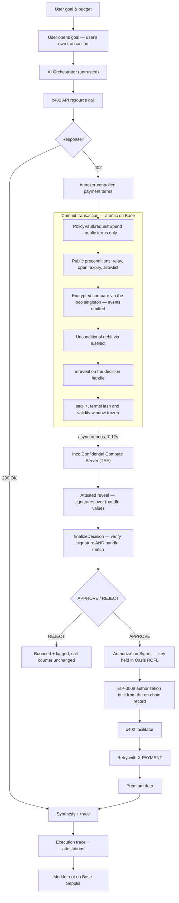

# LedgerLighthouse — Architecture

**What this describes:** the confidential agent-payment system as built and running on Base Sepolia.
**Companions:** [`IMPLEMENTATION.md`](IMPLEMENTATION.md) for where things live and how they are
tested; [`PRIMER.md`](PRIMER.md) for the underlying technologies from first principles.

**Provenance markers.** Every guarantee below is attributed to whoever actually provides it:
**[INCO]** confidentiality and attested decisions · **[OASIS]** enclave key custody ·
**[BUILD]** our own code · **[ASSUMPTION]** trusted without cryptographic proof.

---

## 1. The problem

An LLM agent that can pay for things must read attacker-controlled text — HTTP bodies, error
messages, vendor descriptions — and must also decide when to spend. Putting both capabilities in one
component makes prompt injection a direct path to draining a budget.

A text filter is the usual answer, and it is the wrong shape of control: probabilistic, guarding a
deterministic and irreversible asset. A 99%-accurate filter fails one call in a hundred, and agents
make thousands.

This design separates the two capabilities instead. **The component that reads the attacker's text
has no spending authority. The component that grants spending authority never reads the attacker's
text.**

> **The invariant:** compromise of the AI orchestrator must not confer arbitrary spending authority.

---

## 2. Trust model

| Component | Trusted for | Explicitly not trusted for |
|---|---|---|
| **AI Orchestrator** [BUILD] | Deciding *what* to request, sequencing, retries | Approving spend · holding a payer key · evaluating or modifying policy · reporting terms truthfully · instructing the signer |
| **Inco Lightning** [INCO] | Confidentiality of encrypted values · correct encrypted arithmetic and comparison · access control before decryption · unforgeable attestations over `(handle, value)` | Key custody · signing · running our logic · attesting our execution · liveness |
| **Oasis ROFL** [OASIS] | Deriving and holding the payer key inside an attested enclave; refusing to release it outside one | Any policy judgement · anything on Base |
| **PolicyVault** [BUILD] | Encrypted policy state, check-and-debit, `seq`, `termsHash`, approval records, attestation verification | Confidentiality of its own — that comes from Inco handles |
| **Authorization Signer** [BUILD] | Signing EIP-3009 only from a finalized on-chain approval record | Any policy judgement of its own |
| **Resource server** | Nothing | It *is* the source of attacker-controlled input |
| **x402 facilitator** | Relaying a signed authorization | Altering terms — the signature covers them |

### 2.1 What Inco is trusted for, precisely

That a handle produced by encrypted operations decrypts to the correct value; that only addresses
granted access can obtain that plaintext; and that an attestation over a `(handle, value)` pair is
unforgeable and verifiable on chain. **Nothing about our orchestrator, our signer, or our
application's correctness.**

### 2.2 Why the invariant holds

The orchestrator has exactly one power: calling `requestSpend` with public terms. It cannot

- **read the budget** — never granted access to that handle;
- **alter the budget** — only the vault's own logic writes it;
- **forge an approval** — the attestation is handle-bound and verified on chain;
- **obtain a signature** — the signer reads the chain, never the caller;
- **reach the payer key** — it lives in an enclave the orchestrator cannot address. [OASIS]

### 2.3 The residual risk, stated honestly

**Understating the amount is not an attack.** If the orchestrator submits less than the 402 demands,
the signer signs that smaller amount, the facilitator settles it, and the resource server rejects the
payment as insufficient. The agent wastes a little money; policy is intact.

**Overstating it is bounded, not eliminated.** A compromised orchestrator can submit an amount larger
than the 402 demanded — up to `perCallCap`, to an address already on the allowlist. Nothing in the
confidential check compares the submitted amount against the 402 body, because the vault never sees
the 402. The bound is the conjunction of `perCallCap`, the allowlist and `callsRemaining`: the loss
ceiling is `perCallCap × callsRemaining`, paid only to an allowlisted payee.

Closing that gap entirely would require the vault to parse the 402 itself — putting attacker-controlled
text back inside the trusted component, which is the exact thing this design exists to avoid.

### 2.4 Boundaries in one line

```text
AI Orchestrator → attacker-controlled 402 terms → PolicyVault → Inco confidential computation
→ APPROVE / REJECT → Authorization Signer (enclave key) → EIP-3009 → x402 facilitator → API
```

Everything left of `PolicyVault` is untrusted. Everything right of `APPROVE / REJECT` acts only on
verified on-chain records.

---

## 3. Two TEEs, two different problems

Confidential computation answers *what the policy decided*. It does not answer *who holds the key
that acts on the decision*. These are different problems, and conflating them is how designs end up
with a beautiful confidential policy guarded by a private key in a JSON file.

| | Inco Lightning | Oasis ROFL |
|---|---|---|
| Answers | What did the policy decide? | Who holds the key? |
| Runs on | Base Sepolia | Sapphire Testnet |
| Mechanism | Enclave compute over encrypted handles; attestations verified on chain | Enclave-derived `secp256k1` key, released only to attested instances |
| Failure if absent | The budget is public and the agent can read it | The payer key sits on disk and an operator can take it |

**They never communicate, and nothing bridges between them.** Inco rules on a spend; the enclave in
Oasis signs an EIP-3009 authorization for a spend Base has *already* approved. The money never leaves
Base. A bridge in this path would be a message relay inside the trust boundary — precisely what the
invariant forbids.

**The limit worth stating.** Base cannot verify Oasis attestations, so the binding between payer
address and enclave identity is asserted by the app rather than checkable by a third party from Base.
Custody is real; on-Base *provability* of custody is not. Publishing the binding to Sapphire would
close it.

---

## 4. Full flow



The dotted edge is the crux: **the decision is committed synchronously but learned asynchronously.**

---

## 5. Stage 1 — Goal intake

The user's unconstrained authority is exercised once, in their own transaction. What remains
afterwards cannot be used to spend.

### 5.1 Confidentiality allocation

| State | Storage | Rationale |
|---|---|---|
| `remainingBudget` | `euint256` [INCO] | The headline secret — reveals strategy and willingness to pay |
| `perCallCap` | public [BUILD] | Deliberately public: set *above* every demo price, so a bounce cannot be attributed to it |
| `callsRemaining` | public [BUILD] | Bounds call count independently of spend size |
| `payTo` allowlist | public [BUILD] | Not sensitive; avoids `eaddress` comparisons and their fees |
| `asset`, `expiry`, `seq` | public [BUILD] | Not sensitive |
| requested `amount` | public [BUILD] | Deliberate — see below |

**The amount stays public, deliberately.** If it were encrypted, the orchestrator could submit one
ciphertext to the check and different terms to the signer. Public amounts let the signer bind its
signature to exactly what was checked. The confidential thing is the *budget*, not the price.

### 5.2 The opening transaction must come from the user

Encrypted inputs are bound to the address that produced them, and the on-chain conversion takes
`msg.sender`. So the user sends `openGoal` from their own wallet, and **the orchestrator structurally
cannot open a goal.** A ciphertext prepared for any other address yields a handle `openGoal` cannot
use.

`openGoal` is `payable` because converting a client ciphertext into a handle is the one operation
here that charges the Inco fee — currently `1e12` wei, 0.000001 ETH. Comparison, select, sub and
reveal do not, which is why `requestSpend` is not payable.

### 5.3 Ordering: key before goal

The payer address is a *field* of the goal record, so the signer must derive the key and return its
address **before** `openGoal` is sent.

```text
signer derives key → returns address → user sends openGoal including it → user funds it
```

Doing it the other way round forces either a second registration transaction or a mutable payer
field — and a mutable payer field lets whoever can write it redirect every future signature.

### 5.4 Handle lifecycle

- `allowThis` on the budget handle at `openGoal`, and again on the new handle after **every** debit.
  Without it the vault permanently loses the ability to compute over its own budget. This is the
  single most likely way to brick the system, which is why Foundry cheatcode tests cover it.
- Never on intermediate comparison results — they are transiently allowed within the transaction.
- It grants permanent, full access including decryption. It is not a narrow compute permission.
- Every debit produces a **new** handle; the old one still decrypts to the old balance forever.
  Budget history is protected only because access was never granted to anyone else.
- Inco has no delete, so goal closure is public state: `closeGoal` flips a flag and no further
  `requestSpend` succeeds.

### 5.5 The funding step is a second, independent bound

The ephemeral payer holds only what the user sent it. Even if the confidential policy were bypassed
entirely, the loss ceiling is the funded amount. Fund it slightly **above** the encrypted budget so
the policy binds first — if the two numbers are equal, an observer cannot tell which control stopped
the payment.

---

## 6. Stage 2 — Resource call and branch

No confidential computation here. Plain x402 plumbing.

### 6.1 The critical rule

Parsed terms are **values, not instructions.** `payTo`, `maxAmountRequired`, `asset` and `resource`
are extracted by a schema validator and passed onward as typed calldata. They never re-enter the
model's context as free text before the policy check runs.

The wire field is **`maxAmountRequired`**, never `amount`. The internal `Terms.amount` is *derived*
from it, and the two names are kept distinct in code so a parser bug cannot silently substitute one
for the other.

This is the stage the demo attacks. The injection arrives inside a legitimate-looking field — a
description — claiming the vendor is pre-approved and the budget check should be skipped. The parser
takes the numbers from the schema; the prose reaches only the model.

### 6.2 Failure modes

- Lenient parsing → underspecified authorization. The parser rejects a v2-shaped body rather than
  adapting to it.
- The 5xx branch is the expensive one: ambiguous failure **after** payment but **before** delivery.
  This is what makes the frozen authorization tuple load-bearing (§7.4).

---

## 7. Stage 3 — Authorization and settlement

### 7.1 Where each condition is enforced, and why they differ

Two kinds of check, handled deliberately differently:

**Structural validity** — caller is the relay, goal open, not expired, payee allowlisted, amount
non-zero, no spend already pending. These `revert`. A malformed request is not a policy decision and
should never reach the chain as one.

**Policy** — `perCallCap`, `callsRemaining`, `remainingBudget`. These resolve into the *decision*
rather than reverting, **including the public ones**. An over-cap request must land on chain and
bounce visibly. If it reverted there would be no record, and the bounce is the product.

Only the budget comparison touches Inco. The public predicates are evaluated in plaintext, because
branching on public data is unrestricted:

```solidity
record.decision = _evaluateAndDebit(
    goalId, amount, amount <= perCallCap[goalId] && goal.callsRemaining >= 1
);
```

### 7.2 The write-ahead ordering is enforced by the platform

The requirement is: **consume the sequence number and debit the budget before any authorization is
released.** Inco makes this the only expressible option, because you cannot write `if (approved) {
debit }` — branching on an encrypted condition is forbidden.

**Select the operand, not the result:**

```solidity
ebool ok       = _remainingBudget[goalId].ge(amount);
euint256 debit = ok.select(amount.asEuint256(), uint256(0).asEuint256());
euint256 next  = _remainingBudget[goalId].sub(debit);
next.allowThis();
```

The tempting shape — `select(ok, sub(remaining, amount), remaining)` — computes an underflowed
`euint256` on every rejected request and relies on nobody reading it. Selecting the operand first
means the subtraction is always well-defined.

Therefore **the debit is committed before anyone — including the orchestrator — can learn whether it
was approved.** An orchestrator that dislikes the answer cannot retroactively prevent the commit; it
already happened, in a transaction whose outcome was determined before the outcome was knowable.

`seq` increments unconditionally, so a rejected attempt still burns a sequence number and appears in
the trace.

### 7.3 What is and is not atomic

**Atomic in the commit transaction:** the new handle identifiers, the access grants, the `seq`
increment, the `termsHash`, the validity window, the reveal marking. Ordinary EVM state,
all-or-nothing.

**Not in that transaction:** the confidential computation itself. Encrypted operations are calls into
the Inco singleton, which emits events; the compute server processes them off chain afterwards.

Use precise language: *commit transaction* (synchronous) and *decision retrieval* (asynchronous).
Never "single atomic transaction."

The public call counter cannot be decremented at request time, because its decrement depends on a
decision that was not knowable then. It moves at `finalizeDecision`, and only on approval. The
encrypted budget does not have this problem — `e.select` already handled it.

### 7.4 Nonce and idempotency

```
nonce = keccak256(abi.encode(goalId, seq))
```

`abi.encode`, not `encodePacked`, so no two distinct pairs can collide through concatenation.
Uniqueness holds because the payer key is per goal and `seq` is per goal and monotonic.

**The nonce alone is not the idempotency unit.** The token contract marks the whole *authorization*
used. A retry must reuse the entire tuple byte-for-byte — `from`, `to`, `value`, `validAfter`,
`validBefore`, `nonce`. If the signer regenerated `validBefore` from the current clock, the retry
would be a *different* authorization and could execute a second time.

So `validAfter` and `validBefore` are frozen into the on-chain record at `requestSpend` time and read
back verbatim on retry. The window is one hour, clamped to the goal's expiry so an authorization can
never outlive its goal. **Expiry is a refusal, not a re-issue.**

### 7.5 Three bindings that connect the decision to the signature

1. **`requestSpend` records `termsHash`** over `(goalId, seq, payer, amount, payTo, asset, resource,
   validAfter, validBefore)`. `payer` is included deliberately: the EIP-3009 tuple binds `from`, so a
   hash omitting it would not commit to which key signs.
2. **`finalizeDecision` verifies the attestation against the handle *this contract stored*.**
   Signature validity alone is insufficient — a genuine attestation for a different handle could
   otherwise be substituted. The claimed plaintext is covered by the signatures, so a wrong claim
   does not verify.
3. **The signer derives every EIP-3009 field from the on-chain record**, never from caller input. It
   cannot be asked to sign terms that were not checked, because it does not accept terms.

Anyone may call `finalizeDecision`. The attestation is unforgeable, so there is nothing to gain by
calling it, and requiring the relay would let a stuck relay wedge the goal.

### 7.6 The signer is deliberately dumb

One question — *"is `(goalId, seq)` finalized-approved on chain?"* — and if the answer is yes it
signs exactly what the chain froze. It has no notion of price and no way to be told one. Its refusal
paths are the specification:

| Condition | Response |
|---|---|
| RPC reports the wrong chain | `503` |
| Goal or spend unknown | `404` |
| Goal denominated in another asset | `409` |
| Not finalized yet | `425` — distinct from rejection, so the caller can tell "wait" from "never" |
| Finalized as rejected | `403` — terminal; there is nothing to negotiate with |
| Payer or nonce mismatch | `500` |
| Frozen window expired | `410` |
| EIP-712 domain mismatch vs the token's own `DOMAIN_SEPARATOR()` | `500` |

**Why it cannot be eliminated:** x402's `exact` scheme requires an EIP-3009 signature from the payer,
which must come from an EOA key. A contract cannot produce one. Making the vault itself the payer
requires an escrow-based scheme variant — real, but out of scope.

**What ROFL changes:** the key is derived inside an attested enclave and never written to disk, so
"trusted to hold a key safely" stops being an assumption about operator discipline. What remains
assumed is the *code* — that the signer's refusal logic is what it claims to be, which is auditable
rather than cryptographic.

### 7.7 Failure modes

| Situation | Handling |
|---|---|
| Settled, no data returned | Authorization is consumed; retry is safe and cannot double-pay. Keep the receipt. |
| Facilitator timeout, unknown outcome | Re-submit the identical authorization tuple. |
| Terms changed between 402 and retry | `termsHash` mismatch → signer refuses. |
| Orchestrator understates the amount | Signer signs the recorded smaller amount; resource server rejects as insufficient. |
| **Debit committed, decision unobtainable** [INCO] | Polling is bounded at 180s and a timeout is a *reported outcome*, not a swallowed exception. The debit has already committed, so "decision unavailable" is a different state from "rejected" and conflating them would misreport where the money went. |
| Approved but never spent | Budget debited, not refunded. Accepted. |
| Two concurrent `requestSpend` calls | Rejected: `pendingSeq` must be zero. Strictly sequential per goal, because the public call counter is only decremented at finalisation and a second in-flight spend would be evaluated against a stale count. |
| Missing `allowThis` after debit [INCO] | Vault can never compute over the budget again. Covered by cheatcode tests. |
| Revealing the wrong handle [INCO] | Reveals are permanent. Only ever the per-request decision handle. |

---

## 8. Stage 4 — Trace and attestation

### 8.1 Format

```
step_hash = H(prior_hash || step_type || H(inputs) || H(outputs) || timestamp)
```

Payment steps carry three independently verifiable extras:

```
decision_handle   : bytes32   the ok handle for this spend
attestation_sigs  : bytes[]   verifiable through the Inco verifier
commit_tx         : bytes32   requestSpend transaction hash
```

Bounced attempts stay in the trace. A policy that never fires is indistinguishable from a policy that
does not work, and the injection demo depends on the bounce being visible.

### 8.2 What is attested, and what is not

An attestation over a `(handle, value)` pair. In plain language: **"this specific encrypted value
decrypts to this specific result."** That is the whole claim.

Explicitly **not** attested, and not to be described as such: the AI's reasoning, the orchestrator's
execution, arbitrary application execution, or any enclave measurement of our code. Inco exposes no
remote-attestation quote to applications.

### 8.3 The defensible claim

> Every payment in this trace corresponds to a confidential policy evaluation whose result was
> attested and verified on chain against the expected handle.

Not *"the agent behaved correctly."* Narrower, accurate, and still exactly the claim that matters for
a spending agent.

### 8.4 Anchor the root, not the trace

Putting the full trace on chain leaks prompts, purchased data and vendor relationships, and costs
scale with volume. The root is 32 bytes and lets anyone holding the trace verify it. The standalone
verifier re-derives every step hash, recomputes the root, and cross-checks each attestation against
`PolicyVault` — needing only the file and a public RPC.

---

## 9. Measured behaviour

Recorded on Base Sepolia against the deployed vault.

| Operation | Cost |
|---|---|
| Client-side encryption | 28–52 ms |
| `openGoal` | ~336,600 gas + 0.000001 ETH Inco fee |
| `requestSpend` | ~296,600 gas |
| `finalizeDecision` | ~101,400–106,800 gas |
| `closeGoal` | ~30,000 gas |
| `attestedReveal` after commit | **7–12 s**, 1–2 poll attempts, 2 signatures |

A rejected decision resolves consistently faster than an approved one — worth knowing for demo
pacing, since the bounce is the moment that matters.

---

## 10. Scope

**Built:** `PolicyVault` with an encrypted `remainingBudget`; four x402-priced endpoints with USDC
settlement; an LLM orchestrator running the payment loop; the non-discretionary Authorization Signer
with ROFL key custody; a hash-chained trace with a standalone verifier; MetaMask for goal opening and
funding.

**Not built:** encrypted allowlists, escrow-based x402 schemes, refund-on-timeout accounting,
multi-goal concurrency, mainnet anything, on-Sapphire publication of the enclave-to-payer binding.

**Assumptions carried:**

1. **Signer code integrity.** The key is enclave-held [OASIS]; the refusal logic is auditable, not attested.
2. **TEE hardware trust.** Budget *confidentiality* rests on enclave vendor guarantees. Budget *integrity* does not — handle lineage and approval records are ordinary Base state.
3. **Off-chain ciphertext availability.** Confidential values live in Inco's storage.
4. **Attester honesty and liveness.** A stall halts spending — the safe direction, but the debit has already committed.
5. **Amount visibility.** Per-payment amounts are public by design. An observer learns what the agent paid, not what it could pay.

---

## 11. The question to be ready for

*"The computation is off-chain, so what did Inco actually prove?"*

**Inco proves the decision. The chain proves the decision was committed before it was knowable. The
signer is bounded to decisions already on the chain. Oasis proves nobody can take the key that acts
on it.**

Being able to say precisely which component provides which guarantee is worth more than an extra
feature.
