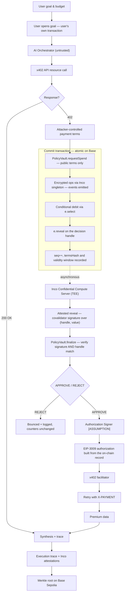
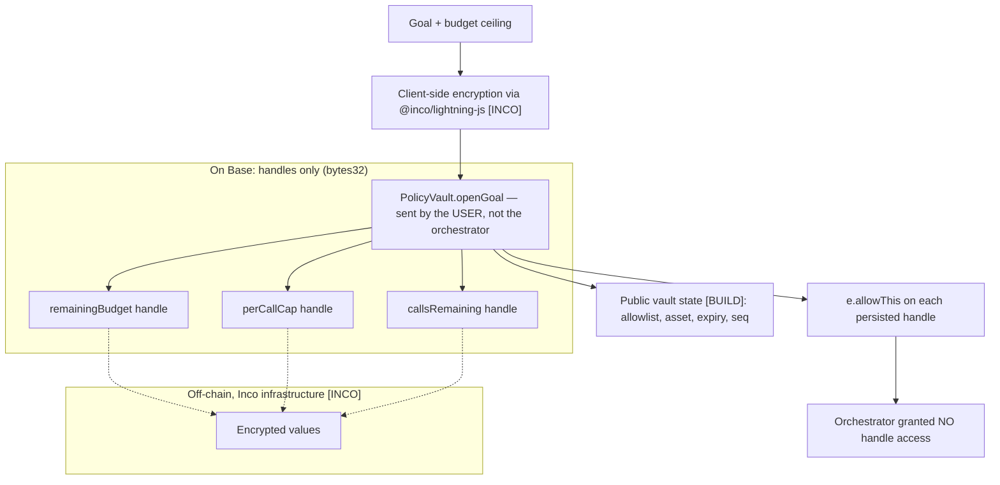
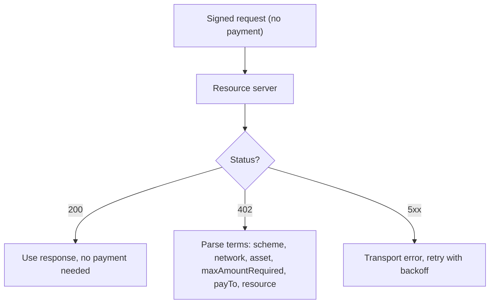
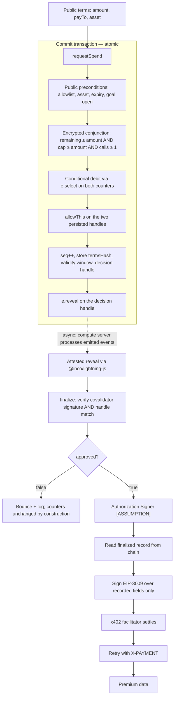
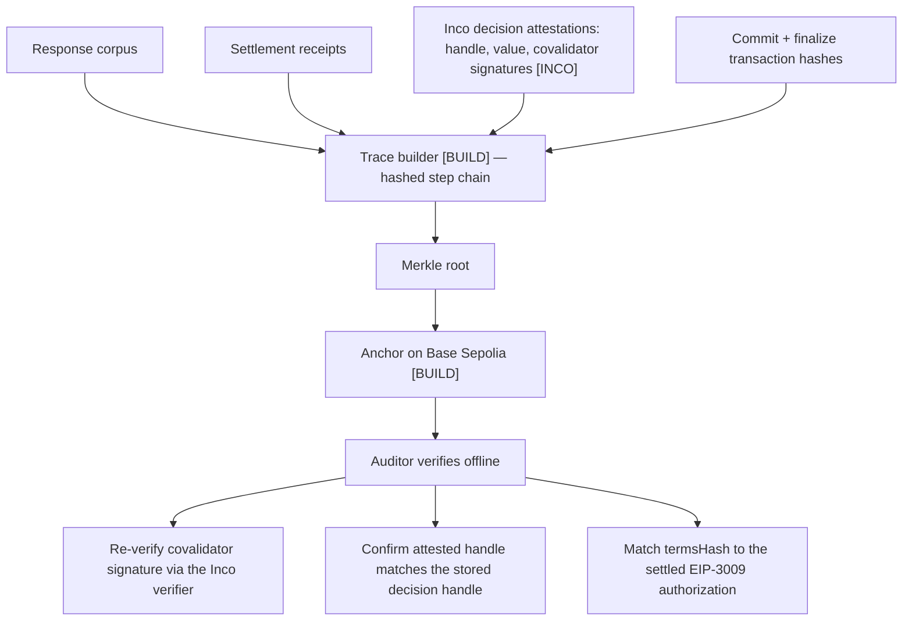

# Inco-Bound Agent Payment Flow — Implementation Plan (v3)

**Status:** architectural source of truth. Self-contained — no prior version required.
**Verified against:** current official Inco documentation (`docs.inco.org`), the Coinbase x402
specification, and Circle's USDC deployment records — August 2026.
**Target:** Base Sepolia, NTU Singapore Web3 + AI hackathon.
**Companion:** `IMPLEMENTATION.md` — the ordered build brief derived from this plan.

**Markers used throughout:**
**[INCO]** provided by Inco · **[BUILD]** we implement · **[ASSUMPTION]** trusted component outside
Inco's guarantees · **[OPEN]** unresolved, verify before coding.

---

## 1. What this builds

An autonomous AI agent that pays for API resources over x402, where the spending policy is enforced
by confidential computation on Inco rather than by the agent itself.

The problem it solves: an LLM agent that can pay for things must read attacker-controlled text
(HTTP responses, API error bodies, vendor descriptions) and must also decide when to spend. Putting
both capabilities in the same component means a prompt injection is a direct path to draining a
budget. This design separates them — the component that reads the attacker's text has no spending
authority, and the component that grants spending authority never reads the attacker's text.

The security invariant, which everything below serves:

> **Compromise of the AI orchestrator must not confer arbitrary spending authority.**

---

## 2. Verified Inco capability baseline

Everything in this section is confirmed in current documentation. The design uses nothing outside it.

### 2.1 What Inco Lightning is

A **confidentiality layer for existing blockchains** — not a new chain, not an enclave you deploy
code into. Three components:

1. **Smart contract library** (`@inco/lightning`) — encrypted types and operations in standard Solidity.
   Imported as `import {e, ebool, euint256} from "@inco/lightning/src/Lib.sol";`. With `using e for *;`
   in the contract body every operation is also callable in method form (`balance.ge(v)`, `handle.allowThis()`),
   which is the form the official examples use. This document writes the free-function form (`e.ge(a, b)`)
   throughout; they are the same calls.
2. **Confidential Compute Server** — runs inside a TEE, executes confidential computations and decryption requests, validates access control before decrypting.
3. **Client-side JS library** (`@inco/lightning-js`) — encrypts inputs, handles decryption requests.

Live on **Base mainnet and Base Sepolia**; Solana is in beta. Base Sepolia is our target.

### 2.2 The execution model — the single most important thing to understand

Encrypted variables are `bytes32` **handles**, not values. The on-chain contract manipulates
identifiers; the actual data is stored **off-chain in encrypted form**.

Every encrypted operation is a call into the **Inco singleton contract**, which checks access
control and **emits an event**. The Confidential Compute Server processes those events off-chain.

Three consequences that shape this entire design:

- **Your contract never sees a plaintext.** Not a number, not a boolean.
- **Handles are immutable.** Reassigning a variable produces a *new* handle; the old handle still exists and still decrypts to the old value. Inco never deletes handles.
- **The transaction commits the handle lineage and access-control state; the computation resolves afterwards.** Synchronous commit, asynchronous result.

### 2.3 Types and operations

| Capability | Confirmed |
|---|---|
| Types | `euint256`, `ebool`, `eaddress` |
| Arithmetic | `e.add`, `e.sub`, `e.mul`, `e.div`, `e.rem`, shifts, rotates |
| Bitwise | `e.and`, `e.or`, `e.xor` — **also work on `ebool`** |
| Comparison | `e.eq`, `e.ne`, `e.ge`, `e.gt`, `e.le`, `e.lt` — all return `ebool` |
| Selection / negation | `e.min`, `e.max` return an `euint256`; `e.not` negates an `ebool`. **These are not comparisons** — do not expect an `ebool` from `min`/`max` |
| Mixed operands | **Binary operations accept an e-type or a plain variable as either argument** |
| Multiplexer | `e.select(ebool, a, b)` for `euint256`, `ebool`, `eaddress` |
| Randomness | `e.rand()`, `e.randBounded()` — require the Inco fee |
| Access control | `e.allow`, `e.allowThis`, `e.reveal`, `e.isAllowed` |

### 2.4 Control-flow restrictions

- **You cannot use `if`/`else` on a condition depending on a private value.** The path taken would leak it.
- **You cannot `revert` on such a condition**, for the same reason.
- The substitute is the **multiplexer pattern**: compute both outcomes, choose with `e.select`.

This is a constraint that turns out to work in our favour — see §7.3.

### 2.5 Access-control semantics

- `e.allow(v, addr)` grants **permanent** access to that specific handle: to see it, publicly decrypt it, **and** compute over it.
- `e.allowThis(v)` is an alias for `e.allow(v, address(this))`.
- Operation results are **transiently** allowed to the calling contract for the current transaction — which is why chained operations work. `allowThis` is needed only for handles **persisted across transactions**.
- `e.reveal(v)` makes a handle **publicly accessible, permanently**. After that, anyone may request its decryption.
- Correct mental model: any account ever granted access — transiently or permanently — must be assumed to know the value forever and to be able to re-share it. Transient is not "safer."
- `e.transientAllow` is documented as not yet available in the SDK. **[OPEN]** — recheck at build time.

### 2.6 Attestations

Inco attests via **covalidator signatures over a `(handle, value)` pair**, verified on-chain through
the Inco verifier contract. The documented struct carries the handle and the value; verification
takes the attestation plus the signature array.

Three retrieval paths:

| Path | Requires | Use |
|---|---|---|
| `attestedDecrypt` | EIP-712 signature from an address with `e.allow` access | Private reveal to one party |
| `attestedReveal` | Handle already passed to `e.reveal` — **anyone may request** | Public results |
| `attestedCompute` | One handle vs **one public scalar**, ops limited to `Eq/Ne/Ge/Gt/Le/Lt` | Simple predicates, no extra tx |

**Mandatory pattern:** verifying the signature is not enough. You must also check that the attested
handle equals the handle you expected. Otherwise a genuine attestation for a *different* handle can
be substituted.

### 2.7 What Inco does not provide

- **No key custody. No transaction signing.** Nothing in the documentation offers either.
- **No remote-attestation quote exposed to applications.** There is no enclave measurement of *your* code to verify. Do not describe Inco as attesting to application execution.
- **No deletion.** Handles are permanent.
- **No durability guarantee you control.** Ciphertexts live in Inco's off-chain storage.

### 2.8 Six things that are easy to get wrong

1. **"Encrypted state lives on-chain."** No — handles live on-chain, values live off-chain. Base gives you durable *identifiers and decisions*, not durable *values*.
2. **"The check and the decision happen in one atomic transaction."** The commit is atomic; the plaintext decision arrives later, after the compute server processes the emitted events.
3. **"`allowThis` is a compute permission."** It grants full access including decryption, and only persisted handles need it.
4. **"Inco attests to my application running correctly."** It attests that a specific handle decrypts to a specific value. Nothing more.
5. **"Chain finality gives me replay protection."** It gives ordering. Application-level replay protection is yours to build.
6. **"I can express my whole policy with `attestedCompute`."** Only single-handle-versus-scalar comparisons. Anything compound must be computed on-chain first.

---

## 3. Trust model

| Component | Trusted for | Explicitly not trusted for |
|---|---|---|
| **AI Orchestrator [BUILD]** | Deciding *what* to request, sequencing, retries | Approving spend · holding keys · evaluating or modifying policy · reporting terms truthfully · instructing the signer |
| **Inco Lightning [INCO]** | Confidentiality of encrypted values · correct encrypted arithmetic and comparison · enforcing access control before decryption · unforgeable covalidator signatures over `(handle, value)` | Key custody · signing · running our logic · attesting our execution · liveness |
| **PolicyVault [BUILD]** | Encrypted policy state, check-and-debit, `seq`, `termsHash`, approval records, attestation verification | Confidentiality of its own — that comes from Inco handles |
| **Authorization Signer [ASSUMPTION]** | Custody of the per-goal payer key; signing EIP-3009 only from a finalized on-chain approval record | Any policy judgement of its own |
| **Resource server** | Nothing | It is the source of attacker-controlled input |
| **x402 facilitator** | Relaying a signed authorization | Altering terms — the signature covers them |

### 3.1 What Inco is trusted for, precisely

That a handle produced by encrypted operations decrypts to the correct value; that only addresses
granted access via `e.allow` or `e.reveal` can obtain that plaintext; and that a covalidator
signature over a `(handle, value)` pair is unforgeable and verifiable on-chain. **Nothing about our
orchestrator, our signer, or our application's correctness.**

### 3.2 Why the invariant holds

The orchestrator has exactly one power: calling `requestSpend` with public terms. It cannot:

- **read the budget** — never granted access to those handles;
- **alter the budget** — only the vault's own logic writes it;
- **forge an approval** — the covalidator signature is handle-bound and verified on-chain;
- **obtain a signature** — the signer reads the chain, never the caller.

**Understating the amount is not an attack.** If the orchestrator submits a smaller amount than the
402 demands, the signer signs that smaller amount, the facilitator settles it, and the resource
server rejects the payment as insufficient. The agent wastes a little money; policy is intact.

**Overstating it is the residual risk, and it is bounded rather than eliminated.** A compromised
orchestrator can submit an amount larger than the 402 demanded, up to `perCallCap`, to an address
already on the allowlist. Nothing in the confidential check compares the submitted amount against the
402 body — the vault never sees the 402. The bound is the conjunction of `perCallCap`, the allowlist
and `callsRemaining`: the loss ceiling is `perCallCap × callsRemaining`, paid only to an
allowlisted payee. That is the honest statement of the guarantee, and it is the one to make on stage.
Closing it entirely would require the vault to verify the 402 itself, which would put attacker-controlled
text back inside the trusted component — the exact thing this design exists to avoid.

### 3.3 Trust boundaries in one line

```text
AI Orchestrator → attacker-controlled 402 terms → PolicyVault → Inco confidential computation
→ APPROVE / REJECT → Authorization Signer → EIP-3009 → x402 facilitator → API
```

Everything left of `PolicyVault` is untrusted. Everything right of `APPROVE / REJECT` acts only on
verified on-chain records.

---

## 4. Full flow



The dotted edge is the crux: **the decision is committed synchronously but learned asynchronously.**

---

## 5. Stage 1 — Goal intake and policy compilation

The user's unconstrained authority is exercised once, in their own transaction, and what remains
afterwards cannot be used to spend.



### 5.1 Confidentiality allocation

| State | Storage | Rationale |
|---|---|---|
| `remainingBudget` | `euint256` **[INCO]** | The headline secret — reveals strategy and willingness to pay |
| `perCallCap` | `euint256` **[INCO]** | Reveals negotiating position to a vendor pricing dynamically |
| `callsRemaining` | `euint256` **[INCO]** | Bounds call count independently of spend size |
| `payTo` allowlist | public **[BUILD]** | Not sensitive; avoids `eaddress` comparisons and their fees |
| `asset`, `expiry`, `seq` | public **[BUILD]** | Not sensitive |
| requested `amount` | public **[BUILD]** | Deliberate — see below |

All three encrypted values participate only in comparisons against public scalars and in
subtraction, both documented operations. The representation is sound.

**The amount stays public — deliberately.** If it were encrypted, the orchestrator could submit one
ciphertext to the check and different terms to the signer. Public amounts let the signer bind its
signature to exactly what was checked. The confidential thing is the *budget*, not the price.

### 5.2 The opening transaction must come from the user

Encrypted inputs are bound to the address that produced them, and the on-chain conversion takes
`msg.sender`. Therefore **the user sends `openGoal` from their own wallet**. The orchestrator
structurally cannot open a goal without the user's key — a property worth preserving deliberately
rather than discovering by accident.

### 5.3 Handle lifecycle — what `allowThis` actually guarantees

- Call `e.allowThis` on all three handles at `openGoal`, and on `remainingBudget` and `callsRemaining` again **after every update**. Without it the vault permanently loses the ability to compute over its own budget. `perCallCap` never changes, so its open-time grant is the only one it needs.
- Do **not** call it on intermediate comparison results — they are transiently allowed within the transaction already.
- It grants permanent, full access to that specific handle, including decryption. It is not a narrow compute permission.
- Every debit produces a **new** handle. The old one still decrypts to the old balance forever. Budget history is protected only because access was never granted to anyone else — which is why the orchestrator gets none.
- Inco has no delete. **Goal closure is a [BUILD] concern**: mark the goal closed in public state so no further `requestSpend` succeeds.

### 5.4 Deliverables

- **[BUILD]** `PolicyVault.openGoal` — accepts three ciphertexts plus public policy fields, converts them to handles, grants `allowThis`, registers the goal.
- **[BUILD]** Browser encryption of the three budget values.
- **[BUILD]** Goal registry: `goalId → (handles, public fields, owner, open/closed)`.
- **[ASSUMPTION]** Per-goal ephemeral payer key generated by the Authorization Signer; its address registered against the goal at open time and funded by the user.

**Ordering matters here and is easy to get backwards.** The payer address is a field of the goal
record, so the signer must generate the key and return its address *before* `openGoal` is sent — the
user's transaction carries that address. Generating the key after the goal is open forces either a
second registration transaction or a mutable payer field, and a mutable payer field is a hole: it lets
whoever can write it redirect future signatures to a key of their choosing. Sequence:
**signer generates key → returns address → user sends `openGoal` including it → user funds it.**

### 5.5 Decisions

- **Denomination:** USDC on Base Sepolia — `0x036CbD53842c5426634e7929541eC2318f3dCF7e`, 6 decimals,
  `FiatTokenV2_2`, EIP-712 domain `name: "USDC"`, `version: "2"`, `chainId: 84532`. Assert the address
  and chain id in the signer before every signature. Fiat denomination would require a price oracle
  inside the confidential path — out of scope.
- **Call-count ceiling:** keep it. It is the cheap defence against many-small-payments drain, independent of individual amounts.
- **Allowlist confidentiality:** `eaddress` + `e.eq` would hide *which* vendors are permitted, at the cost of an extra encrypted comparison per request. Deferred.

### 5.6 Failure modes

- A policy that compiles but is unenforceable ("spend reasonably").
- **[INCO]** Missing `allowThis` on a persisted handle → vault can never compute over its budget again. The single most likely way to brick the demo. Cover with Foundry cheatcode tests.
- **[INCO]** Over-granting access. Never grant the orchestrator access to a budget handle, not even to debug.
- **[INCO]** Allowance vouchers are broad by design — a voucher grants the holder access to **all** of the signer's handles across every Inco dApp. If the demo frontend uses one: expiry in minutes, revoke after.
- Expiry checked only at open time rather than at spend time.

---

## 6. Stage 2 — Resource call and branch

Inco plays no part here. This is plain x402 plumbing, and it should be built first.



### 6.1 Deliverables **[BUILD]**

- HTTP client that treats `402` as **control flow**, not an error.
- Strict schema parser for the x402 payment-requirements payload — no string coercion, no defaulted missing fields.
  Note the real field names: an entry in `accepts[]` carries `scheme`, `network`, `asset`,
  **`maxAmountRequired`** (not `amount`), `payTo`, `resource`, `description`, `maxTimeoutSeconds` and
  `extra`. Our internal `amount` is *derived* from `maxAmountRequired`; keep the two names distinct in
  code so a parser bug cannot silently substitute one for the other.
- Pin the protocol version. x402 v1 uses the `X-PAYMENT` request header and `X-PAYMENT-RESPONSE` on the
  way back; the v2 specification renames these to `PAYMENT-REQUIRED`, `PAYMENT-SIGNATURE` and
  `PAYMENT-RESPONSE`, and expresses `network` as CAIP-2 (`eip155:84532`). Build against one, state which,
  and make the mock server speak only that version.
- Response cache keyed by request, so a retry after a network blip does not re-enter the payment path.

### 6.2 The critical rule

Parsed terms are **values, not instructions**. Extract `payTo`, `maxAmountRequired`, `asset` and
`resource` with a schema validator and pass them onward as typed calldata. They must never re-enter
the model's context as free text before the policy check runs.

This is the stage the demo attacks. The injection will arrive inside a legitimate-looking field — a
description or memo — claiming the vendor is pre-approved and the budget check should be skipped.

### 6.3 Failure modes

- Lenient parsing → underspecified authorization.
- The 5xx branch is the expensive one: ambiguous failure **after** payment but **before** delivery. This is what makes the frozen authorization tuple load-bearing (§7.6).

---

## 7. Stage 3 — Authorization and settlement



### 7.1 The policy check

Public preconditions, enforced with ordinary `require` — these leak nothing:

```
payTo ∈ policy.allowlist
asset == policy.asset
now < policy.expiry
goal is open
```

Encrypted predicate, evaluated over Inco handles as a three-way conjunction:

```
remainingBudget  >= amount
perCallCap       >= amount
callsRemaining   >= 1
```

Combined with `e.and` on the resulting `ebool`s. The `amount` is a **public scalar** — permitted,
since binary operations accept a plain variable as either argument.

### 7.2 Why the composite predicate must be computed on-chain

`attestedCompute` evaluates **one handle against one public scalar** with a single comparison. Our
predicate spans three handles. It cannot be expressed as one call, and splitting it into three
separate calls would leak each conjunct individually — an attacker could learn *which* limit was hit
and recover the budget by bisection.

So: compute the conjunction on-chain, so only a single composite `ebool` exists; `e.reveal` that one
handle; retrieve it with `attestedReveal`. Once revealed the handle is public and anyone may request
the attestation — including the orchestrator, which is convenient and harmless, since it cannot
forge one.

### 7.3 The write-ahead ordering is enforced by the platform

The requirement is: **consume the sequence number and debit the budget before any authorization is
released.** Inco makes this the only expressible option.

You cannot write `if (approved) { debit }` — branching on an encrypted condition is forbidden. The
debit must be a `e.select` applied unconditionally. **Select the operand, not the result:**

```
amountDebit    = e.select(ok, amount, 0)      -- 0 when rejected
callDebit      = e.select(ok, 1, 0)
remaining      = e.sub(remaining, amountDebit)
callsRemaining = e.sub(callsRemaining, callDebit)
```

The tempting shape — `e.select(ok, e.sub(remaining, amount), remaining)` — is *probably* safe, because
when `ok` is false the underflowed intermediate is discarded by the select. But it computes an
underflowed `euint256` on every rejected request and relies on nothing ever reading it. Selecting the
operand first means the subtraction is always well-defined, and it is the shape Inco's own confidential
token example uses. Prefer it; it costs the same number of singleton calls.

Therefore **the debit is committed before anyone — including the orchestrator — can learn whether it
was approved.** An orchestrator that dislikes the answer cannot retroactively prevent the commit; it
already happened, in a transaction whose outcome was determined before the outcome was knowable.

`seq` increments unconditionally, so a rejected attempt still burns a sequence number and appears in
the trace.

### 7.4 What is and is not atomic

**Atomic in the commit transaction:** the new handle identifiers, the access-control grants, the
`seq` increment, the `termsHash`, the validity window, and the reveal marking. All ordinary EVM
state, all-or-nothing.

**Not in that transaction:** the confidential computation itself. Encrypted operations are calls
into the Inco singleton, which emits events; the Confidential Compute Server processes them
off-chain afterwards.

**Use precise language:** *commit transaction* (synchronous) and *decision retrieval*
(asynchronous). Never "single atomic transaction."

**[OPEN]** How a caller knows a revealed handle is ready to decrypt — polling versus an event
signal — is not documented. `finalize` needs a bounded retry strategy, not a fixed sleep. Test on
Base Sepolia before building around any timing assumption.

### 7.5 Connecting the Inco decision to the signature

Three bindings, all required:

1. **`requestSpend` records `termsHash`** over `(goalId, seq, payer, amount, payTo, asset, resource, validAfter, validBefore)` in public storage, alongside the decision handle. **Include `payer`** — the EIP-3009 tuple binds `from`, so a hash that omits it does not commit to which key will sign, and the signer's own check against the goal record becomes the only thing standing between a swapped payer address and a valid signature.
2. **`finalize` verifies both the covalidator signature and that the attested handle equals the stored decision handle.** Signature validity alone is insufficient — a genuine attestation for a different handle could otherwise be substituted. This check is mandatory, and the documentation calls it out explicitly.
3. **The signer derives every EIP-3009 field from the on-chain record**, never from caller input. It cannot be asked to sign terms that were not checked, because it does not accept terms.

### 7.6 Nonce and idempotency

`nonce = keccak256(abi.encode(goalId, seq))` — `abi.encode`, not `abi.encodePacked`, so that no pair
of distinct `(goalId, seq)` values can collide through concatenation. EIP-3009 nonces are arbitrary
`bytes32` tracked per authorizer; deterministic derivation is what makes safe retry possible.
Uniqueness holds because the payer key is per-goal and `seq` is per-goal and monotonic.

**The nonce alone is not the idempotency unit.** The token contract marks the *authorization* used.
A retry must reuse the **entire tuple byte-for-byte** — `from`, `to`, `value`, `validAfter`,
`validBefore`, `nonce`. If the signer regenerates `validBefore` from the current clock, the retry is
a *different* authorization and can double-pay.

**Therefore: freeze `validAfter` and `validBefore` into the on-chain record at `requestSpend` time
and read them back on retry.** After an unknown facilitator outcome, re-submit the identical
authorization; never generate a fresh one.

### 7.7 The Authorization Signer **[ASSUMPTION]**

Inco provides no key custody and no signing, so this component is necessary, not preferred.

- Holds the per-goal ephemeral payer key. One endpoint: sign for `(goalId, seq)`.
- Reads the approval record on-chain and refuses if not finalized-approved.
- **Non-discretionary** — no policy of its own. Compromise permits re-signing *already-approved* spends, not inventing new ones. That bound is what makes it an acceptable hackathon assumption, and it must be stated openly rather than hidden.
- **Why it cannot be eliminated:** x402's `exact` scheme requires an EIP-3009 signature from the payer, which must come from an EOA key. A contract cannot produce one. Making the vault the payer requires an escrow-based scheme variant — real, but out of hackathon scope.

### 7.8 Failure modes

| Situation | Handling |
|---|---|
| Settled, no data returned | Authorization is consumed; retry is safe and cannot double-pay. Keep the receipt. |
| Facilitator timeout, unknown outcome | Re-submit the identical authorization tuple. |
| Terms changed between 402 and retry | `termsHash` mismatch → signer refuses. |
| Orchestrator understates the amount | Signer signs the recorded smaller amount; resource server rejects as insufficient. Money wasted, policy intact. |
| **[INCO] liveness** | **Debit committed, decision unobtainable.** If the compute server or covalidators stall, `finalize` cannot complete and the counters have already moved. Funds are not lost on-chain, but the goal's budget is stuck. Hackathon: accept and show it. Production: a timeout-and-reclaim path with its own encrypted accounting. |
| Approved but never spent | Budget debited, not refunded. Accepted for the hackathon. |
| Two concurrent `requestSpend` calls | Handle assignment is serialized by EVM ordering, so both cannot read the same pre-debit handle. **[OPEN]** — behaviour when the compute server lags the handle graph is undocumented. Verify on testnet before relying on rapid-fire spends. |
| **[INCO]** Missing `allowThis` after debit | Vault can never compute over the budget again. |
| **[INCO]** Revealing the wrong handle | Reveals are permanent. Only ever reveal the per-request decision handle. |

### 7.9 Cost note **[BUILD]**

Each encrypted operation is an external call to the Inco singleton plus an event. Counting the happy
path: three comparisons, two `e.and`s, two selects, two subtractions, two `allowThis` grants and one
reveal — twelve singleton calls per `requestSpend`. Measure gas early; this is the main reason the
payment path might feel slow on stage.

---

## 8. Stage 4 — Synthesis and attestation



### 8.1 Trace format

```
step_hash = H(prior_hash || step_type || H(inputs) || H(outputs) || timestamp)
```

Payment steps carry three extra fields, all independently verifiable:

```
decision_handle   : bytes32   -- the ok handle for this spend
covalidator_sigs  : bytes[]   -- verifiable through the Inco verifier
commit_tx         : bytes32   -- requestSpend transaction hash
```

Bounced attempts stay in the trace. A policy that never fires is indistinguishable from a policy
that does not work, and the injection demo depends on the bounce being visible.

### 8.2 What Inco attests to — and what it does not

A covalidator signature over a `(handle, value)` pair. In plain language: **"this specific encrypted
value decrypts to this specific result."** That is the whole claim.

Explicitly **not** attested, and not to be described as such:

- The AI's reasoning.
- The orchestrator's execution.
- Arbitrary application execution.
- Any enclave measurement of our code — no remote-attestation quote is exposed to applications.

### 8.3 The defensible claim

> Every payment in this trace corresponds to a confidential policy evaluation whose result was
> attested by Inco's covalidators and verified on-chain against the expected handle.

Not *"the agent behaved correctly."* Narrower, accurate, and still exactly the claim that matters for
a spending agent.

### 8.4 Anchor the root, not the trace

Putting the full trace on-chain leaks prompts, purchased data and vendor relationships, and costs
scale with volume. The root is 32 bytes and lets anyone holding the trace verify it.

### 8.5 Deliverables **[BUILD]**

- Canonical trace format and Merkle accumulator.
- `TraceAnchor` contract on Base Sepolia.
- **Standalone verifier** taking `(trace, root, attestations)` → valid/invalid, with no dependency on our infrastructure beyond a public RPC.

---

## 9. Build order

Sequence by what unblocks the most, not by stage number.

1. **Stage 2 against a mock 402 server.** No money, no Inco. Proves x402 control flow and the strict terms parser. Decide v1 versus v2 of the x402 spec here and write it down — the header names and the `network` encoding differ between them, and discovering the mismatch against a live facilitator in Stage 3 is an avoidable evening.
2. **Stage 3 on Base Sepolia with a plain `uint256` budget.** Prove EIP-3009 signing, facilitator round-trips and authorization-tuple idempotency before any encryption exists.
3. **Move policy enforcement into Inco.** Swap counters to `euint256`, replace the `require`-based check with the encrypted conjunction and selects, add `allowThis` on persisted handles, add the reveal → attested-reveal → `finalize` round trip. Now a contained diff against a working system — which is exactly why it comes third. **This step adds a second transaction and an asynchronous wait to the payment path.** Budget demo time for it.
4. **Stage 4 last.** The trace format stabilises only once handles and attestation shape are fixed.

### 9.1 Inco-specific build notes

- Use the Foundry template with Inco cheatcodes to simulate the environment in Solidity tests **[INCO]**. Discover `allowThis` mistakes locally, not on testnet at 2am.
- **SDK naming gotcha:** the package was renamed to `@inco/lightning-js`; older documentation samples still show `@inco/js`. Follow the migration guide.
- Base Sepolia is the correct target. Base mainnet is live; Solana is beta.
- Avoid `e.rand()` entirely — nonce derivation does not need randomness, and random functions require the Inco fee.
- **[OPEN]** Confirm which operations charge the Inco fee before finalising the vault's payable surface. `inco.getFee()` appears in documented examples beyond randomness.

---

## 10. Open decisions

### 10.1 What Inco solves **[INCO]**

- Confidentiality of budget, cap and call count, with programmable on-chain access control.
- Correct encrypted comparison and arithmetic without revealing operands.
- A verifiable, handle-bound attestation of the policy decision.
- Structural enforcement of write-ahead ordering, via the impossibility of branching on encrypted conditions.

### 10.2 What we build **[BUILD]**

- `PolicyVault` — encrypted counters, check-and-debit, `seq`, `termsHash`, frozen validity window, approval records, attestation verification, goal closure.
- x402 client, strict terms parser, response cache.
- Authorization Signer service.
- Trace builder, Merkle accumulator, `TraceAnchor`, standalone verifier.

### 10.3 Trusted assumptions **[ASSUMPTION]**

1. **Authorization Signer integrity.** Not attested. Bounded to re-signing already-approved spends.
2. **TEE hardware trust.** Inco Lightning is TEE-based; budget *confidentiality* rests on enclave vendor guarantees. Budget *integrity* does not — the handle lineage and approval records are ordinary Base state.
3. **Off-chain ciphertext availability.** Confidential values live in Inco's off-chain storage. We depend on its durability and availability.
4. **Covalidator honesty and liveness.** A stall halts spending — the safe direction, but the debit has already committed.
5. **Amount visibility.** Per-payment amounts are public by design. An observer learns what the agent paid, not what it could pay.

### 10.4 Rollback and persistence, layer by layer

| Layer | Provided by | Status |
|---|---|---|
| Approval records, `seq`, `termsHash` | Base Sepolia | **Solid.** Ordinary EVM state with chain finality. |
| Handle identifiers and lineage | Base Sepolia | **Solid.** Handles are on-chain `bytes32`. |
| Confidential values behind handles | Inco off-chain storage **[INCO]** | **Dependency.** Handles are never deleted, but availability is outside our control. |
| TEE internal state | Not exposed | **Nothing to rely on, nothing to roll back.** We hold no sealed enclave state. |
| Replay of confidential computation | Deterministic from the handle graph | Should be deterministic, but do not *depend* on it for spend safety. |
| **Application-level replay protection** | **Ours [BUILD]** | **`seq` + `termsHash` + the frozen EIP-3009 authorization tuple. This is the layer that actually prevents double-spend — not Inco, and not chain finality alone.** |

### 10.5 Still open **[OPEN]**

| # | Question | Blocks |
|---|---|---|
| 1 | Readiness signal for a revealed handle — polling versus event | Stage 3 |
| 2 | Compute-server lag under two rapid successive spends | Stage 3 |
| 3 | Exact per-operation Inco fee scope | Stage 3 |
| 4 | `e.transientAllow` availability at build time | Stage 3 |
| 5 | Client-side encryption method name and signature in `@inco/lightning-js` | Stage 1 |
| 6 | Whether a reclaim path for debit-committed-decision-unobtainable fits in hackathon time | Stage 3 |

**Closed since the last revision** — no longer blocking:

- *Retrieval call and whether a wallet is required.* The JS SDK client exposes
  `zap.attestedReveal([...handles])`, returning plaintexts plus covalidator signatures suitable for
  re-submission on-chain. Because `e.reveal` has already made the handle public, **no EIP-712 wallet
  signature is required** — which is what lets the payment loop run unattended. `attestedDecrypt` is the
  signature-requiring sibling and is deliberately not used here.
- *USDC address and EIP-3009 domain.* Base Sepolia USDC is
  `0x036CbD53842c5426634e7929541eC2318f3dCF7e`, 6 decimals, domain `name: "USDC"`, `version: "2"`.
  The 402 body also carries these in `extra.name` / `extra.version`; treat the on-chain values as
  authoritative and the 402's copy as a claim to be checked against them.

Items 1 and 2 are the most likely to cost a day. Test both on Base Sepolia early.

---

## 11. Hackathon scope

**Ship:**

- `PolicyVault` on Base Sepolia with encrypted `remainingBudget`, `perCallCap`, `callsRemaining`.
- One x402-priced endpoint (self-hosted is fine) with USDC settlement on Base Sepolia.
- A minimal LLM orchestrator running the payment loop.
- The deliberately dumb Authorization Signer.
- A trace viewer showing each step, each decision, and the handle behind it.
- MetaMask for goal opening and payer funding.

**Do not ship:** encrypted allowlists, escrow-based x402 schemes, refund-on-timeout accounting,
multi-goal concurrency, mainnet anything.

### 11.1 MetaMask boundaries

MetaMask signs exactly three things: `openGoal`, the USDC funding transfer, and goal closure. It
signs **nothing inside the payment loop** — that is what the ephemeral payer key is for, and what
`e.reveal` (public, no EIP-712 signature required) makes possible. A wallet prompt appearing
mid-payment means the design has drifted.

Fund the ephemeral payer with slightly **more** USDC than the encrypted budget. That gives a second,
independent spending bound — even if the Inco policy were bypassed entirely, the loss ceiling is the
funded amount — while ensuring the demo shows the Inco policy binding first. If the two numbers are
equal, a judge cannot tell which control stopped the payment.

### 11.2 Prepare for the obvious judge question

*"The computation is off-chain, so what did Inco actually prove?"*

Inco proves the decision. The chain proves the decision was committed before it was knowable. The
signer is bounded to decisions already on the chain. Being able to say precisely which component
provides which guarantee is worth more than an extra feature.

---

## 12. Demo

```text
Malicious API → 402 + prompt injection → AI agent follows the malicious instruction
              → PolicyVault + Inco evaluation → REJECT
              → no valid payment authorization → no money moves
```

**Setup.** Connect MetaMask, switch to Base Sepolia, open a goal with an encrypted budget, fund the
ephemeral payer. Show the budget handle on Basescan: an opaque `bytes32` that reveals nothing.

**Run 1 — honest 402.** Request, price, `requestSpend`, approve, settle, data returns.

**Run 2 — malicious 402.** Inflated price plus an injection claiming pre-approval and demanding the
budget check be skipped. Beat by beat:

1. Show the orchestrator's reasoning **complying** with the injection. This is the crucial moment — it proves the attack succeeded at the model layer. Do not soften it.
2. Show that compliance means calling `requestSpend`, because that is the only spending action available to it.
3. Show the commit transaction landing, with the debit path executing unconditionally and the outcome not yet knowable to anyone.
4. Show the revealed decision resolving to **false**, counters unchanged, `finalize` recording a rejection.
5. Show the signer refusing — there is no approved record to sign against.
6. Show the bounce in the trace, with its handle and covalidator signatures, verifiable by anyone.

**The line to land:** the agent was successfully manipulated and the money still did not move —
because the component that decides never reads the attacker's text, and the component that signs
only reads the chain.
